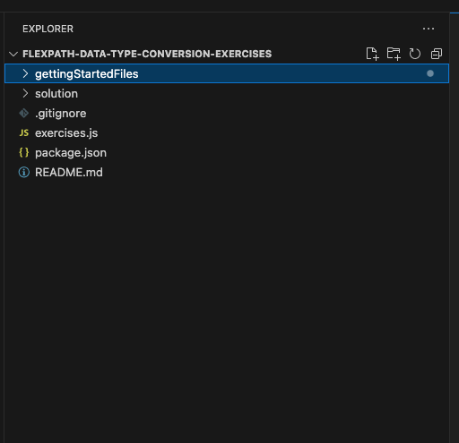

# flexpath-data-type-conversion-exercises

## Exercise overview

The intention of this exercise is to give you more experience working with JavaScript's
data types and converting values from one type to another.

## Getting Started

1. Using Visual Studio Code, open the folder `flexpath-data-type-conversion-exercises` 
   wherever you saved it on your device. 
2. Your VS code file explorer window should look like this:
   
3. Then open up the `exercises.js` file in the `flexpath-data-type-conversion-exercises` folder. 
   Inside of this file we have provided exercises for you to complete, written 
   in code comments. For each exercise, please code ONLY in the space 
   between the comments `// CODE IN THE OPEN LINES BELOW` and `// CODE IN THE OPEN LINES ABOVE` 
4. To run your code for different exercises, you will update the exercise mentioned
   on line 20 of the file. 
   
5. After changing that line, make sure to SAVE the file before running it.
6. To run your code in exercises.js, you will update line 20 to run the exercise code
   you want to run and save the file. THEN, open a Terminal window in VS Code 
   by going to your toolbar at the top of the page and selecting 
   "Terminal" -> "New Terminal"
7. Inside of this terminal, check that you have Node.js installed by running the 
   command `node -v`. If your computer doesn't recognize that keyword, please
   go back and ensure you installed Node.js correctly.
8. To run `exercises.js` you will then use the command `node exercises.js` in the
   terminal to run the file.

We have included a screen recording showing this process in the file
`run-exercise-2-recording.mp4` in this repo.

VIDEO DISCLAIMER - You will need to clone the repo to your local device before
you can watch the .mp4 file since GitHub does not support watching it from here.

Exercise solutions are in the `/solution` folder

&nbsp;
---

### Summary of JavaScript Concepts Covered in These Exercises

1. **Data Types**:
    
    - Primitive data types such as strings, numbers, booleans, null, and undefined.
    - Objects and arrays as non-primitive data types.
    - Differences between primitive and reference types.
2. **Type Conversion**:
    
    - Converting between different data types (e.g., strings to numbers, numbers to booleans).
    - Using `typeof` to determine the type of a variable.
    - Handling `NaN` and checking for it using `isNaN`.
3. **String Manipulation**:
    
    - Using template literals for string interpolation.
    - Common string methods like `toUpperCase`, `toLowerCase`, `indexOf`, and `includes`.
4. **Date and Time**:
    
    - Working with the `Date` object and its methods, like `toDateString` and `toLocaleDateString`.
    - Formatting dates and times for different locales using `Intl.DateTimeFormat`.
5. **Number Formatting**:
    
    - Using methods like `Math.round`, `Math.ceil`, and `Math.floor`.
    - Formatting numbers with `toFixed` and for different locales with `Intl.NumberFormat`.
6. **JSON**:
    
    - Converting objects to JSON strings using `JSON.stringify`.
    - Parsing JSON strings back to objects using `JSON.parse`.
    - Handling JSON parsing errors.
7. **Boolean Logic**:
    
    - Truthy and falsy values.
    - Converting values to booleans and understanding boolean contexts.
8. **Locale and Internationalization (i18n)**:
    
    - Using locale codes to format numbers, dates, and currency.
    - The concept of locales and how it affects string and number formatting.
